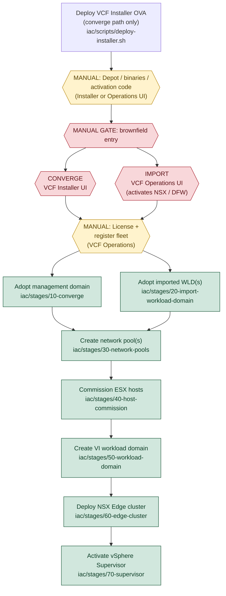

# Architecture — Adopt-then-Expand

This framework does **not** provision a VCF 9.1 estate from nothing. It onboards
an **existing** (brownfield) environment through a manual gate and then drives
fleet growth with Terraform. The design principle is **adopt-then-expand**:

1. **Adopt** — a manual gate (converge or import) creates a domain in a VCF UI.
   Terraform then reads that domain read-only (`data "vcf_domain"`) so its
   identifiers are available to later stages. Adoption changes nothing about
   the domain itself.
2. **Expand** — subsequent Terraform stages add new network pools, hosts,
   workload domains, edge clusters, and Supervisors to the adopted fleet.

## Why manual gates exist

The `vmware/vcf` provider has **no resource** for converging a standalone
vSphere environment or importing an existing vCenter. Both operations are
therefore performed by an operator in a VCF user interface and are represented
here as **manual gates**:

| Gate | Interface | Result |
| --- | --- | --- |
| **Converge** | VCF Installer UI (Converge to VCF) | Your existing standalone vSphere becomes your **first** VCF 9.1 management domain. |
| **Import** | VCF Operations UI (Inventory → Instance → Add Workload Domain → Import a vCenter) | An existing vCenter joins an **already-existing** fleet as a VI workload domain. |

In addition to the two entry gates, two configuration steps are **always
manual**, regardless of how much of the pipeline is automated:

- **Depot / binaries / activation code** — configured in the VCF Installer or
  VCF Operations UI.
- **License + register fleet** — applied and registered in VCF Operations.

## The full ordered pipeline

The pipeline below is the complete brownfield sequence. Manual gates and
always-manual steps are called out explicitly; every automated phase names the
Terraform stage that performs it.



If Mermaid is not rendered, the same sequence in text is:

```
                        deploy VCF Installer OVA        (converge path only, script)
                                   |
        [MANUAL] depot / binaries / activation code     (Installer or Operations UI)
                                   |
                      +------------ MANUAL GATE ------------+
                      |                                     |
             [GATE] CONVERGE                          [GATE] IMPORT
             VCF Installer UI                         VCF Operations UI
             (first mgmt domain)                      (activates NSX / DFW)
                      |                                     |
                      +---------------+---------------------+
                                      |
              [MANUAL] license + register fleet   (VCF Operations)
                                      |
             +------------------------+------------------------+
             |                                                 |
   stage 10-converge                                 stage 20-import-workload-domain
   (adopt mgmt domain)                               (adopt imported WLD[s])
             |                                                 |
             +------------------------+------------------------+
                                      |
                     stage 30-network-pools   (network pool BEFORE hosts)
                                      |
                     stage 40-host-commission
                                      |
                     stage 50-workload-domain
                                      |
                     stage 60-edge-cluster     (edge cluster BEFORE Supervisor)
                                      |
                     stage 70-supervisor
```

### Ordering constraints

Two hard ordering rules are baked into the stage numbering:

- **Network pool before host commission.** A host is commissioned against a
  network pool that provides its vSAN/vMotion addressing, so stage 30 must run
  before stage 40.
- **Edge cluster before Supervisor.** A vSphere Supervisor consumes the NSX
  Edge cluster for its load balancing and north-south connectivity, so stage 60
  must run before stage 70.

The two entry gates are mutually exclusive per onboarding event but not per
fleet: a fleet is typically established by **converge** (stage 10), then grown
by **importing** additional vCenters (stage 20) and by **expanding**
(stages 30→70).

## Isolated per-stage state

Each stage under [`../../iac/stages`](../../iac/stages) is an independent
Terraform root module with its **own isolated state**. Stages are never applied
as one monolith; you run them one at a time:

```bash
make plan  STAGE=30-network-pools
make apply STAGE=30-network-pools
```

This isolation is deliberate:

- A failure or change in one stage cannot corrupt another stage's state.
- Each brownfield gate has a matching adoption stage (10 for converge, 20 for
  import) that can run independently of the expansion stages.
- Expansion stages can be run, re-run, or skipped per site — optional
  expansion sections in `site.yaml` are guarded with `try(...)`, so a stage
  whose configuration is absent is simply a no-op.

## How configuration and outputs flow between stages

There is a **single source of truth** shared by every stage:
[`../../iac/config/site.example.yaml`](../../iac/config/site.example.yaml),
copied to `site.yaml`. Each stage decodes it directly:

```hcl
locals {
  site_file = fileexists("${path.module}/../../config/site.yaml") ? "${path.module}/../../config/site.yaml" : "${path.module}/../../config/site.example.yaml"
  site      = yamldecode(file(local.site_file))
}
```

Because state is isolated, stages coordinate through **`site.yaml` plus
published outputs** rather than through a shared state file:

| Stage | Reads from `site.yaml` | Publishes (outputs) |
| --- | --- | --- |
| `10-converge` | `adoption.management_domain_name` | `management_domain_id`, `management_domain_status`, `management_vcenter` |
| `20-import-workload-domain` | `adoption.imported_workload_domains[]` | `imported_domain_ids`, `imported_domain_status` |
| `30-network-pools` | `network_pools[]` | `network_pool_ids` |
| `40-host-commission` | `hosts_to_commission[]` | commissioned host inventory |
| `50-workload-domain` | `new_workload_domain` | new domain ID / vCenter details |
| `60-edge-cluster` | `edge_cluster` | `edge_cluster_id` |
| `70-supervisor` | `supervisor` | `supervisor_id` |

The adoption stages (10 and 20) exist precisely so that the IDs of the
manually-created domains become first-class values. Downstream stages resolve
the entities they operate on **by name** from `site.yaml` (for example, a host
references its `network_pool_name`, and the edge cluster references its
`domain_name`), which keeps each stage loosely coupled while preserving the
overall order.

Secrets never flow through `site.yaml` or state inputs — they are injected only
via `TF_VAR_*` environment variables (see
[`prerequisites.md`](prerequisites.md)).

## Provider pinning

Every stage pins the same provider set to guarantee a reproducible VCF 9.1 BOM:

| Provider | Version |
| --- | --- |
| `vmware/vcf` | `0.18.1` |
| `vmware/vsphere` | `2.16.1` |
| `vmware/nsxt` | `3.12.0` |

Terraform itself is `>= 1.7` (CI pins `1.9.8`). This framework is pinned to
**VCF 9.1 only**; the `version` key in `site.yaml` documents the target BOM.
Imported domains enter at their earliest component version and are upgraded to
9.1 afterward — see [`import-runbook.md`](import-runbook.md).

## Related documentation

- Entry-path runbooks: [`converge-runbook.md`](converge-runbook.md), [`import-runbook.md`](import-runbook.md)
- UI-only walkthrough: [`manual-deployment-guide.md`](manual-deployment-guide.md)
- Design decisions and topology: [`../design/`](../design/)
- Day-2 operations and upgrades: [`../operations/`](../operations/)

## References

- Broadcom TechDocs — [Converging your existing vSphere infrastructure to a VCF or VVF platform](https://techdocs.broadcom.com/us/en/vmware-cis/vcf/vcf-9-0-and-later/9-1/deployment/converging-your-existing-vsphere-infrastructure-to-a-vcf-or-vvf-platform-.html)
- Broadcom TechDocs — [Import an Existing vCenter to Create a Workload Domain](https://techdocs.broadcom.com/us/en/vmware-cis/vcf/vcf-9-0-and-later/9-1/building-your-private-cloud-infrastructure/working-with-workload-domains/import-an-existing-vcenter-to-create-a-workload-domain.html)
